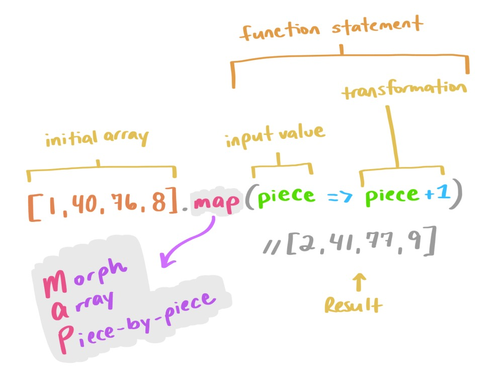
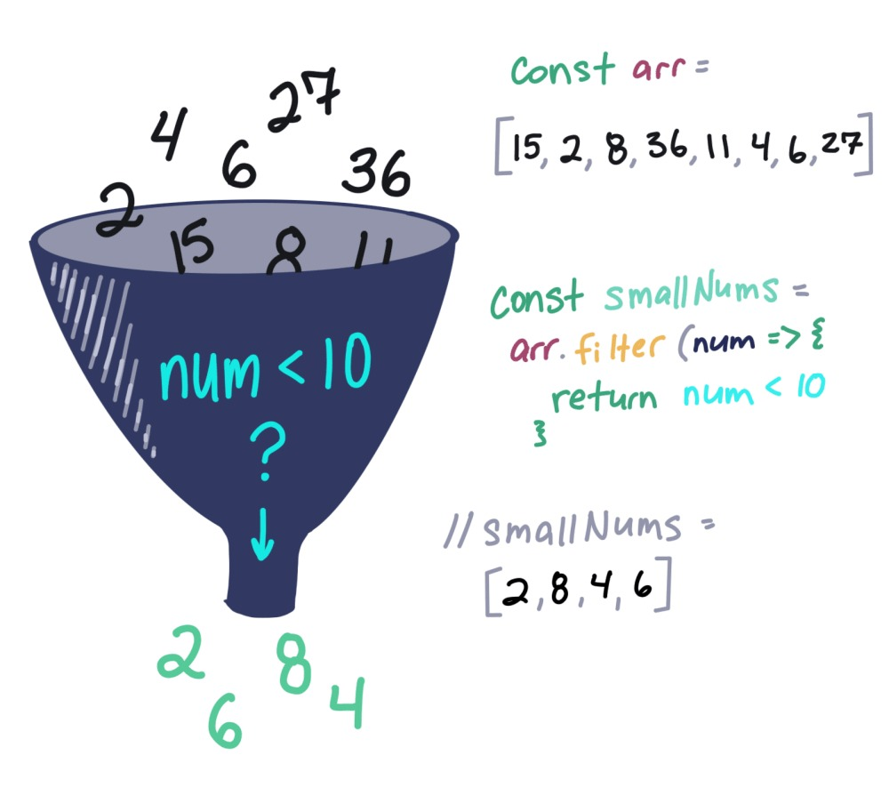
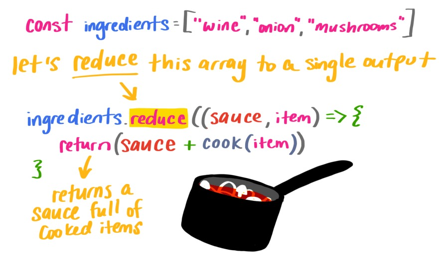

# La Programmation fonctionnelle

## Introduction

La programmation fonctionnelle est un paradigme de programmation (au même titre que la programmation procédurale ou objet). Elle devient très populaire ses derniers temps en raison de la présence de large volumes de données.

De la même manière que la programmation objet est une évolution de la programmation procédurale, la programmation fonctionnelle est une évolution de la programmation objet. Celle ci peut être utilisée en complément de ces deux paradigmes.

Le javascript n'est pas un véritable langage de programmation fonctionnelle (au même titre qu'`Erlang`, `Haskell`, `Elm`, `Elixir` ou encore `Scala`) cependant il intègre la plupart des concepts de programmation fonctionnelle.

## Concepts

### Immutabilité

Un variable n’est jamais mutée, cela permet de ne pas souffrir d’**effets de bord**.
Le principe d'immutabilité permet d'éviter les surprises en évitant les modifications implicites des variables.

En programmation fonctionnelle, x = x + 1 est illégal. **On évite les variables dans la programmation fonctionnelle**.
Les valeurs stockées sont encore nommées des variables du fait de leur fonctionnalité historique au sein de la machine virtuelle ecmascript, mais elles doivent être utilisées plutôt comme des **constantes** ; c'est-à-dire une fois que x prend une valeur, cette dernière restera invariante.

Le code suivant utilise la mutation du tableau :

```javascript
var toto = [ “titi”, “tata”];
// on recrée une variable pour éviter de muter la variable originale
var bibi = toto.push(“toto”);
```

Au contraire, celui-ci crée une copie du tableau, plutôt que de le modifier en place :

```javascript
var toto = [ “titi”, “tata”];
// on peut aussi faire ca avec l'opérateur de decomposition es6
var bibi = [...toto, “toto”]
```

> **Warning** L'utilisation de l'immutabilité peut avoir un effet négatif sur les **performances** en multipliant les données à stocker en mémoire. Pour limiter ces problèmes les langages de programmation peuvent sauvgarder les structure complexes (tableau, map, hash) comme un ensemble de référence (une sorte d'arbre).

#### La librairie [Immutable.js](https://facebook.github.io/immutable-js/)

Les données définies à partir de _Collections_ d'immutable.js ne peuvent pas être modifiées une fois créées, ce qui permet un développement d'applications sans effet de bord.

La librairie propose les structures non mutables suivantes : `List`, `Stack`, `Map`, `OrderedMap`, `Set`, `OrderedSet` et `Record`.

```javascript
// importe l'objet Map de immutable.js
const { Map } = require('immutable')
// on peut faire toto ou "toto"
let lol = Map({ toto: "omg" })
console.log( Map.isMap(lol) )//true
console.log( lol.get("toto") )//omg
lol.set( {"immutable" : "mwai"} )
console.log( lol )// <--- Map { "toto": "omg" } !!
```

Avec l'objet Map, les valeurs sont uniquement accessibles via un getter

```javascript
const { OrderedMap } = require('immutable')
let hi = OrderedMap({un: "one"})
let jh = OrderedMap({deux: "two"})
let azerty = hi.concat(jh)
azerty // OrderedMap {size: 2, _map: Map, _list: List, __ownerID: undefined, __hash: undefined}
azerty.map(x => console.log(x)) // one, two
```

Une `Map` garanti également que l'ordre d'itération des clés entrées sera dans le même ordre que lors de leur insertion via la méthode `set()`.

### La purité ou fonctions pures

Une fonction pure est une fonction qui remplit les conditions suivantes :

* Elle prend au moins un argument (voir plus loin)
* Le résultat de la fonction ne dépend que des arguments et d'aucun contexte extérieur
* La fonction n'a pas d'effets de bords / d'effets secondaires, c'est a dire qu'elle ne modifie directement la valeur qui lui est passé mais renvoir plutot une nouvelle valeur

> **Hint** D'une certaine façon, les fonctions pures poursuivent le même concept d’immutabilité des variables, cette fois attribué aux opérations.

```javascript
// Cette fonction est pure car elle n'a pas d'effet de bords et ne dépend de rien d'autre que ses arguments
let push = function (tableau, clef)
{
    return [...tableau, clef]
};
```

```javascript
// Ces fonctions ne sont pas pures, car le résultat varie et ne dépend pas des arguments
Date.now()
Math.rand()
```

#### Retours sur les fonctions

Dans un langage de programmation fonctionnelle, celles-ci sont des citoyens de première classe.

##### Elles peuvent être assignées à des variables :

```javascript
const f = (m) => console.log(m)
f('Test')
```

Puisqu'elles peuvent être assignées à une variable, elle peuvent donc être ajoutées à des objets.

```javascript
const obj = {
  f(m) {
    console.log(m)
  }
}
obj.f('Test')
```

Mais également à des tableaux

```javascript=
const a = [
  m => console.log(m)
]
a[0]('Test')
```


##### Elles peuvent être utilisées en tant qu'argument pour d'autres fonctions :

```javascript
const f = (m) => () => console.log(m)
const f2 = (f3) => f3()
f2(f('Test'))
```

##### Elles peuvent être la valeur de retour d'autres fonctions

```javascript
const createF = () => {
  return (m) => console.log(m)
}
const f = createF()
f('Test')
```

##### Les fonctions d'ordre supérieur ou `higher order functions`

Il s'agit des fonctions qui acceptent ou retournent d'autres fonctions.

Par exemple, dans la librairie standard de JavaScript:
`Array.map()`, `Array.filter()`, et `Array.reduce()`

###### Les fonctions fléchées ES6

On comprend désormais l'intérêt des fonctions fléchées ajoutées en ES6. Elles permettent de d'alléger le code des `higher order functions` :

```js
[ 1, 2, 4 ].map( v => v *3 ); // [ 3, 6, 12 ] 
```

### Récursivité

En programmation, la `récursivité` consiste à créer une méthode ou une procédure qui s’invoque elle-même.

```javascript
let array = [1, 2, [3, 4], 5, [6, [7,8]]];

let addOne = function(v) {
 if(v instanceof Array) {
 // on va relancer addOne() pour 3, 4, 6, 7 et 8
 return v.map(addOne)
  } else {
    return v + 1
  }
}

// retourne [2, 3, [4, 5], 6, [7, [8, 9]]]
array.map(addOne)
```

ou

```javascript
function repeat(operation, num) {
    if (num > 0) {
        operation()
        repeat(operation, --num)
    }
}
```

**Notion Avancée :** [*Tail call*](http://benignbemine.github.io/2015/07/19/es6-tail-calls/)


### Fonctions composables, modulables, paramétrables

La composition est une autre fonctionnalité clef de la programmation fonctionnelle. **Elle repose sur le principe de purité.**

**La composition est la manière de générer une fonction d'ordre supérieur, en combinant des fonctions plus simples**

#### La composition en détail

Un des moyens les plus répandus pour composer des fonctions en simple JavaScript est de les chaîner entre elles:

```javascript=
obj.doSomething()
   .doSomethingElse()
```

On peut également passer une fonction dans une autre fonction:

```javascript=
obj.doSomething(doThis())
```

#### La composition avec la librairie `lodash`

Plus généralement, 'composer' consiste à rassembler plusieurs fonctions entre elles afin d'exécuter une opération plus compliquée.

`lodash/fp` est livré avec une implémentation de `compose`: on exécute une liste de fonctions, en y passant en premier notre argument à modifier, puis **chaque fonction hérite de l'argument retourné par la fonction précédentes**.

Vous noterez que l'on a pas besoin de stocker de valeurs intermédiaires.

```javascript=
import { compose } from 'lodash/fp'

const slugify = compose
(
  encodeURIComponent
  ,join( '-' ),
  ,map( toLowerCase )
  ,split( ' ' )
)

slufigy('Hello World') // hello-world
```

>**Warning** L'ordre des arguments semble inversé, mais il suit en fait l'ordre d'imbrication naturel des fonctions. C'est-à-dire que `encodeURIComponent` enveloppe `join`, etc. [Article à ce sujet](https://medium.com/making-internets/why-using-chain-is-a-mistake-9bc1f80d51ba)


## Les fonctions essentielles

### Map

Map gère le parcours du tableau et nous gérons la transformation :

```
var numbers = [1, 2, 3]

var newNumbers = numbers.map(function(number){
    return number * 2;
})

// newNumbers => [2, 4, 6]
```



### Filter


```
var numbers = [1, 2, 3, 4];

var newNumbers = numbers.filter(function(number){
    return (number % 2 !== 0);
}

// newNumbers => [1, 3]
```



### Reduce
```
var numbers = [1, 2, 3, 4];

var totalNumber = numbers.reduce(function(total, number){
    return total + number;
}, 0);

// totalNumbers => 10
```




## Principes d'optimisation 

### Évaluation paresseuse

Le principe de l'évaluation paresseuse est que l'exécution d'un bout de code ne se fasse pas avant qu'on ait réellement besoin
des résultats de ce bout de code.

Cela sert principalement pour de l'optimisation : on évite des faire des calculs inutiles. En terme de maintenabilité
on peut exprimer des structures de données infinies et également définir des structures de contrôle comme des abstractions au lieu de primitives.

Tout cela, au final, permet d'obtenir un code modulaire et efficace.

> Comment ?


Notamment grâce à [librairie Lodash](https://lodash.com/) qui permet principalement de manipuler les collections.

Exemple :

Prenons ces deux fonctions ainsi qu'un tableau avec des valeurs.

```js
var t = [0, 1, 2, 3, 4];

function plusUn(nb) {
    console.log(nb + ' + 1');
    if (nb > 2) console.log('Traitement long');
    return nb + 1;
}

function petit(nb) {
    console.log(nb + ' plus petit que 3 ?');
    return nb < 3;
}
```


En JS natif, nous exécutons :

```js
var js = t
        .map(plusUn)
        .filter(petit)
        .slice(0, 2);
```

Ce que fait ce programme :

```
// 13 calculs ont été effectué dont 2 traitements longs
0 + 1
1 + 1
2 + 1
3 + 1
Traitement long
4 + 1
Traitement long
1 plus petit que 3 ?
2 plus petit que 3 ?
3 plus petit que 3 ?
4 plus petit que 3 ?
5 plus petit que 3 ?
[ 1, 2 ]
```

Alors qu'avec Lodash, nous avons :

```
var _ = require('lodash');
var lodash = _(t)
        .map(plusUn)
        .filter(petit)
        .take(2)
        .value();
```

Nous obtenons :

```
// Seulement 5 calculs et aucun traitement long
0 + 1
1 plus petit que 3 ?
1 + 1
2 plus petit que 3 ?
[ 1, 2 ]
```

Maintenant imaginez cette optimisation avec une énorme structure de données, le temps que vous pourrez gagnez 
en calcul.

### Traitements asynchrones

Afin de ne pas bloquer le traitement de données, il est préférable de faire reposer son code sur des opérations asynchrones.

### async / await en ES7

Réécrire les fonctions pour qu'elles supportent le traitement asynchrone :

```js
const waitFor = (ms) => new Promise(r => setTimeout(r, ms));

async function asyncForEach(array, callback) {
  for (let index = 0; index < array.length; index++) {
    await callback(array[index], index, array)
  }
}

const start = async () => {
  await asyncForEach([1, 2, 3], async (num) => {
    await waitFor(50)
    console.log(num)
  })
  console.log('Done')
}
start()
```

[async forEach gist](https://gist.github.com/Atinux/fd2bcce63e44a7d3addddc166ce93fb2)

Librairies disponibles :

* [RxJS](https://rxjs-dev.firebaseapp.com/guide/overview)
* [async](http://caolan.github.io/async/)
* [contrλ](https://github.com/bevacqua/contra)


## Sources

### Ouvrages

* [Functional Light, Kyle Simson](https://github.com/getify/Functional-Light-JS/) 
* [Javascript allongé, Reg “raganwald” Braithwaite](https://leanpub.com/javascriptallongesix/read)
* [Professor Frisby Introduces Composable Functional JavaScript](https://egghead.io/courses/professor-frisby-introduces-composable-functional-javascript)

### En français

* [La programmation fonctionnelle, Grafikart](https://www.grafikart.fr/tutoriels/programmation-fonctionnelle-878)
* [La très bonne traduction de Flavio Copes par Quentin Aimé, oui oui !](https://github.com/Quentin-Aime/hetic-programmationFonctionnelleDoc)

### Articles en anglais

* [An Illustrated (and Musical) Guide to Map, Reduce, and Filter Array Methods](https://css-tricks.com/an-illustrated-and-musical-guide-to-map-reduce-and-filter-array-methods/)
* [un article de ouf sur Medium](https://medium.com/@cscalfani/so-you-want-to-be-a-functional-programmer-part-1-1f15e387e536)
* [un autre plus axé composition et monades](https://medium.com/javascript-scene/composing-software-an-introduction-27b72500d6ea)
* [Le must de la programmation function en es6](https://leanpub.com/javascriptallongesix/read)
* [Série d'articles suivre](https://medium.freecodecamp.org/functional-programming-in-js-with-practical-examples-part-1-87c2b0dbc276)
* [Un article de fond qui avait disparu (merci la wayback machine)](https://web.archive.org/web/20170202023826/https://medium.com/@xilefmai/efficient-javascript-14a11651d563)
* [Introduction à la programmation fonctionnelle en ecmascript](https://medium.com/@chetcorcos/functional-programming-for-javascript-people-1915d8775504)